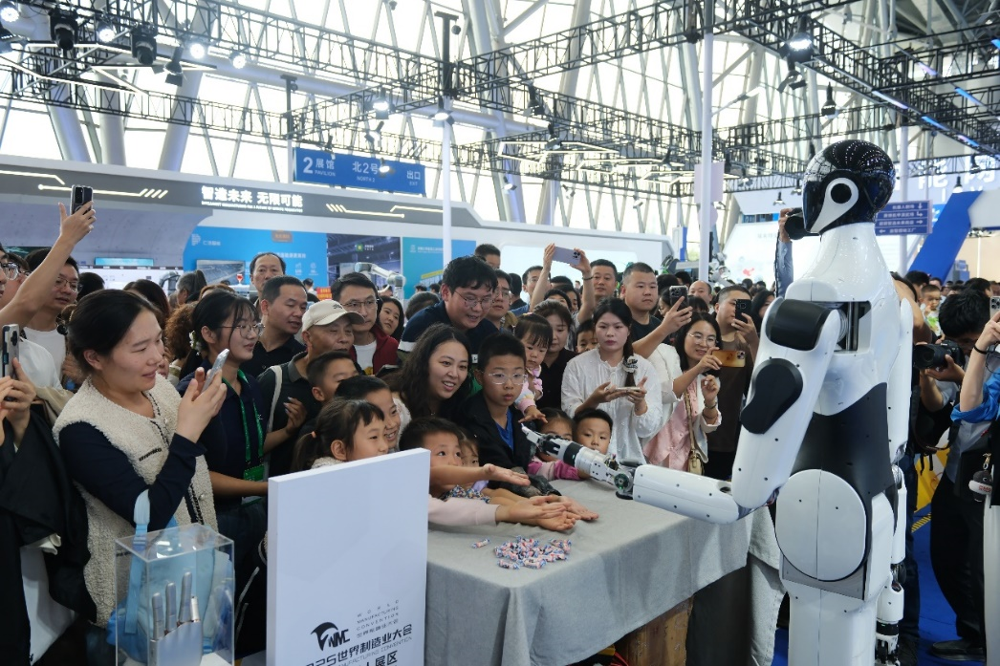
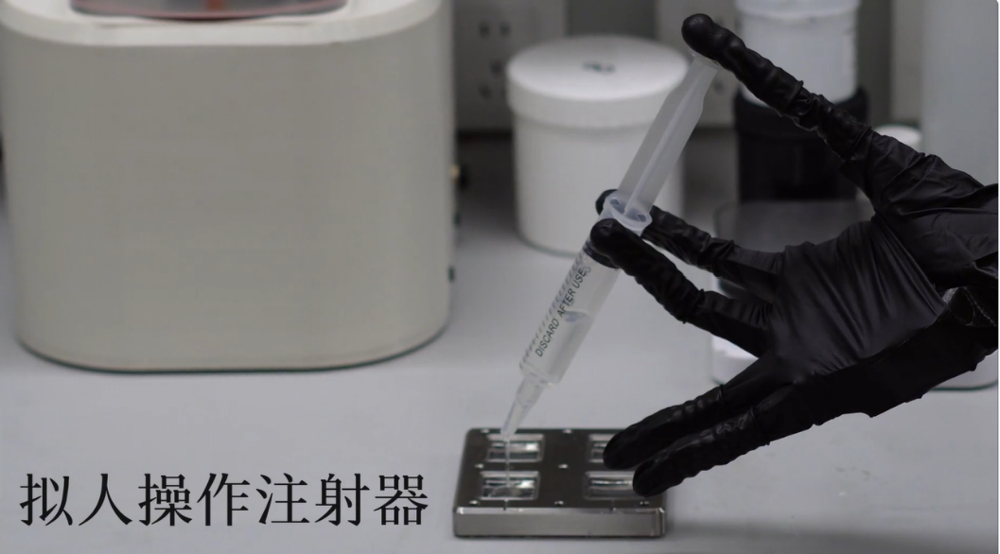
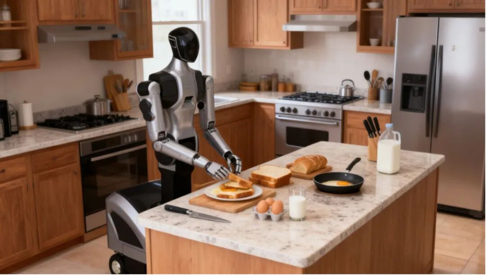

### 融资破局立标杆，绳驱先锋锚定具身智能新方向
专注于仿肌腱绳驱机器人与视触灵巧手研发的安徽弦动未来科技有限公司（下称 “弦动未来”）宣布完成首轮数千万元融资。本轮的融资资金将主要用于人才梯队的建设、研发投入及技术迭代，为公司技术落地与市场拓展注入关键动能。
弦动未来成立于2025年9月5日，是安徽省首家聚焦“绳驱机器人+具身智能”的领军企业，也是江淮前沿技术协同创新中心投资孵化的产业化公司，核心业务覆盖仿肌腱的绳驱机器人、视触灵巧手及视触传感器产品的研发、生产与产业化。

### 专家领衔筑根基，技术闭环建壁垒
弦动未来不仅掌握了绳驱核心技术的研发能力，更注重产学研深度融合，与多家高校和研究机构建立合作关系，持续推动技术创新和产业应用，技术团队主要来自于江淮中心、清华大学、中国科学技术大学、哈尔滨工业大学、重庆大学等知名高校和科研院所。清华大学长聘教授、江淮中心首席科学家梁斌担任公司首席科学家，哈尔滨工业大学（深圳）徐文福教授和清华大学李翔长聘副教授联合担任公司技术顾问。

梁斌教授是国内绳驱机械臂领域的权威专家，深耕绳驱领域20余年，造诣深厚，与徐文福教授合著《绳驱超冗余机器人运动学及轨迹规划》专著，系统阐述了绳驱机器人的理论和方法，多次获得各类奖项，其首创“力位型融合柔顺控制技术”解决了绳索蠕变的行业难题，实现复杂场景下的安全精准操控，成为公司全系产品的 “技术底座”。

在梁斌教授带领下，团队在柔性绳驱机器人的绳驱关节构型设计、刚柔耦合多体动力学建模、精密变刚度柔顺控制算法、系统集成优化等关键技术上取得了系列突破，获得了多项省部级、国家级奖项，实现全栈技术自研，拥有全流程自主知识产权，为技术产业化奠定了坚实基础。

### 打造核心产品矩阵，适配多领域应用需求
在当前机器人产业发展中，传统刚性机械臂在复杂场景下的操作局限性日益凸显——服务领域难以满足人机协作的安全性与灵活性需求，工业领域无法高效适配狭小空间、高危环境的作业场景，而绳驱技术凭借柔性传动、精准控制、安全兼容的核心优势，成为填补上述技术空白的关键方向。

弦动未来基于对行业需求的深度洞察，聚焦绳驱机器人及配套感知执行产品研制，形成覆盖服务、工业两大领域的核心产品矩阵，有效解决机器人“灵巧操作”与“场景适配” 核心难题，为多行业智能化升级提供技术支撑。

在具体产品矩阵布局上，既包含聚焦人机安全协作、规划用于家庭辅助、商业服务等场景服务性绳驱机器人，也涵盖针对工业场景痛点、狭小空间与高危环境作业的工业用绳驱蛇形柔性臂，同时布局作为机器人灵巧执行核心部件、含直驱/绳驱双版本的多自由度视触灵巧手，以及计划为执行末端提供感知数据支撑、适配多类操作场景的视触传感器部件，形成服务与工业场景互补、执行与感知功能协同的产品体系。

同时，弦动未来绳驱视触灵巧手已实现核心功能验证，并于9月29日发布功能演示视频，视频中灵巧手具备沸水捞物、丝滑注射、稳定移液等能力，宣告弦动未来已实现绳驱传动方案与视触融合感知的系统性创新。

此外，视触觉传感器已完成性能测试，相关技术指标达到行业领先水平，不日将正式发布。

### 乘势产业东风，开启规模化发展新篇章
弦动未来以“技术驱动，赋能产业”为核心理念，致力于将先进的柔性仿肌腱绳驱机器人技术转化为满足市场需求的可靠产品和解决方案。发展初期，弦动未来将重点研发绳驱具身智能机器人与视触灵巧手两大类产品，面向工业领域，为航空航天、半导体制造、精密仪器等行业提供超高精度、大工作范围的灵活操作平台;面向服务领域，为存在高服务需求的酒店、家庭等强交互场所提供柔顺安全的智能服务机器人。
