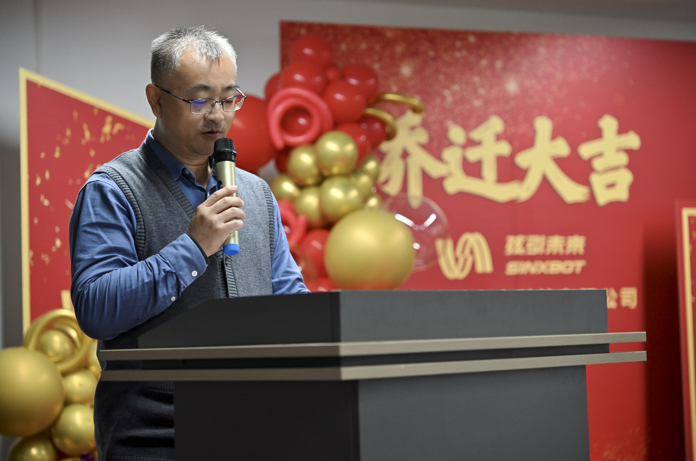
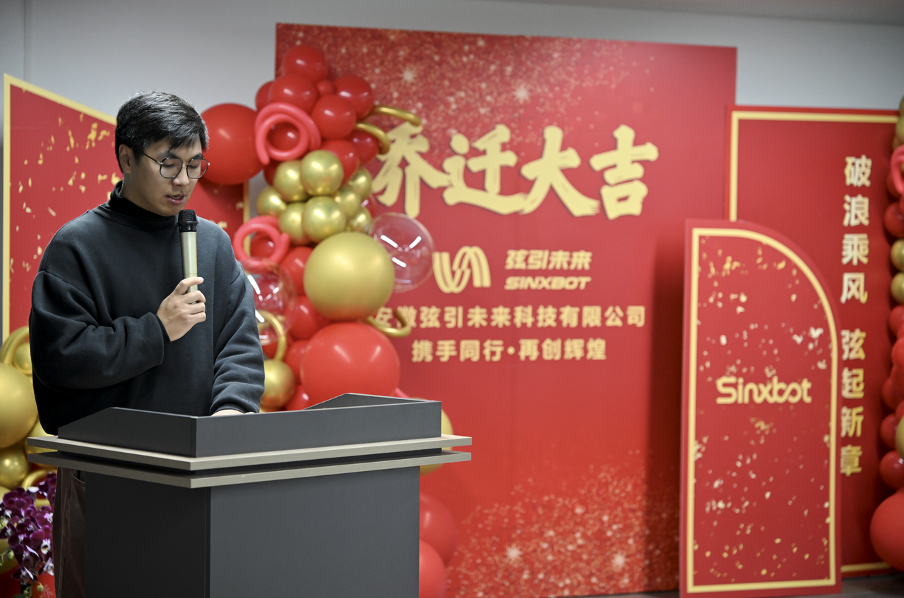
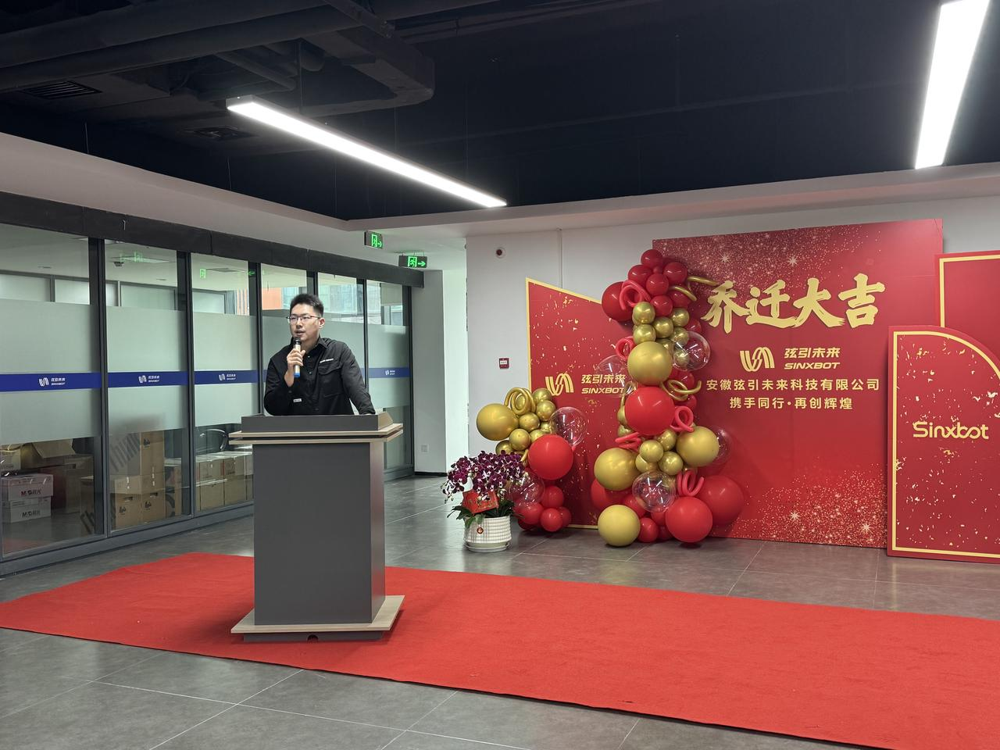
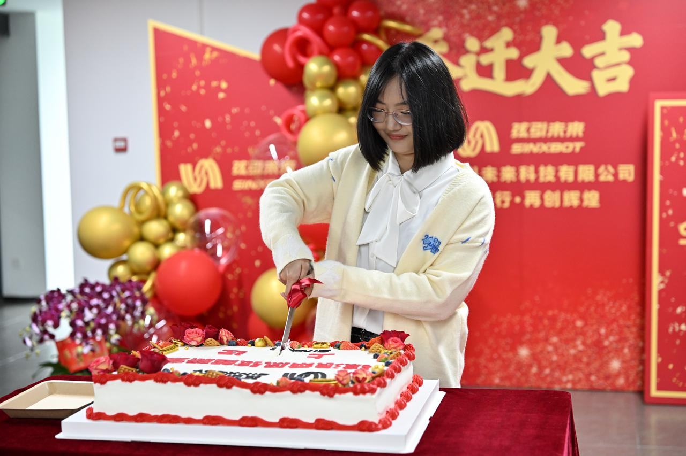
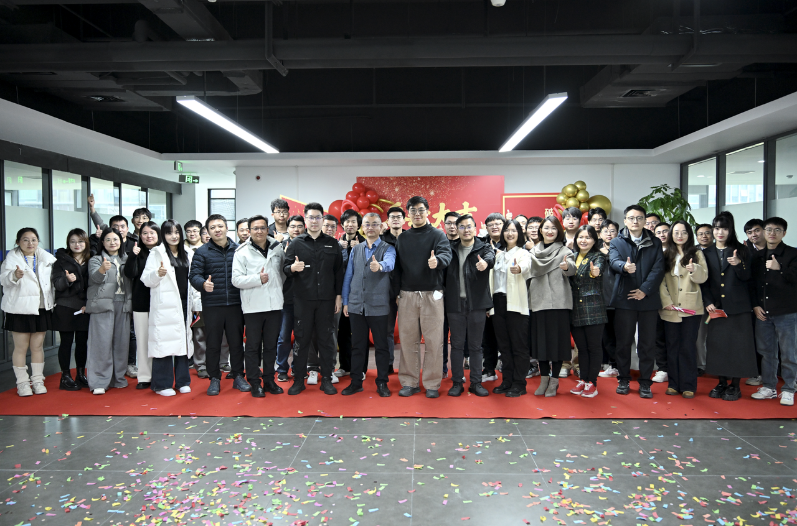
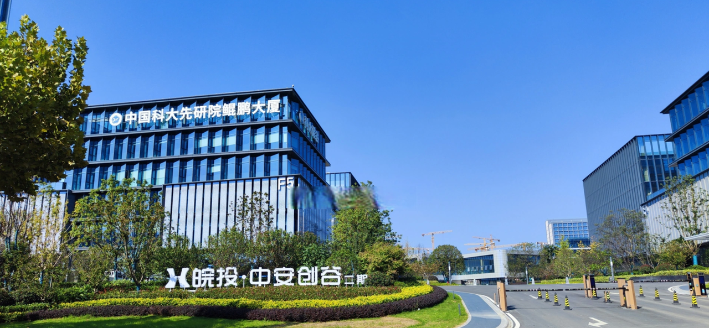

2025年12月12日上午，安徽弦引未来科技有限公司乔迁庆典在合肥市高新区中安创谷二期H3-2楼隆重举行，本次典礼邀请到了公司各方股东、投资人及重要合作伙伴与行业嘉宾共同见证了公司的里程碑时刻，共话“绳驱机器人+具身智能”的新篇章。

此次乔迁不仅是办公环境焕然新生，更是公司立足于合肥的新起点，同时标志着弦引未来将迈入一个新的征程，更彰显了科技创新，敢于突破，拓展未来的坚定决心。

### 【嘉宾代表致辞】 

乔迁致辞环节，江淮中心综合管理部部长王国忱，表示将持续赋能，为企业链接更多场景与资源。

陶彦博博士代表弦引未来首席科学家、清华大学梁斌教授发表讲话，回顾弦引未来从实验室到产业化的跃迁历程，寄语团队“让绳驱技术走向更广阔的天地”。

弦引未来联合创始人兼执行总裁马璁发表了乔迁致辞，回顾了当前弦引未来的发展历程及公司的发展愿景，并向长期支持公司的伙伴与合作商致谢。

### 【弦聚此刻】

在热烈掌声中，弦引未来联合创始人兼执行董事田蓥梅执刀切下乔迁蛋糕，与嘉宾共享甜蜜，一同拉开弦引未来的崭新篇章。

镜头定格，此次乔迁仪式到场嘉宾与弦引未来全体员工在“弦引未来”前并肩合影，为今日的乔迁喜悦留存永恒记忆。

新征程已起航，弦引未来将继续深耕柔性绳驱机器人赛道，与各方携手，把“绳驱机器人+具身智能”拉进更广阔的未来。

### 【新址介绍】

弦引未来坐落于安徽省合肥市蜀山高新区中安创谷二期H3栋，中安创谷是由安徽省投资集团和合肥高新区联合设立的安徽中安创谷科技园有限公司建设运营的科创园区，位于合肥国家高新技术产业开发区，总规划面积约260万平方米，分六期开发建设，被纳入安徽省“科大硅谷”核心区。园区重点发展新一代信息技术、人工智能、生命健康、空天信息和科技金融等战略性新兴产业，配套全球路演中心、运动中心及地铁接驳专线等设施。