&emsp;&emsp;12月27日至28日，以 “成就AI原生时代先锋开发者” 为主题的2025华为开发者大赛暨开发者年度会议在上海华为练秋湖研发中心成功举办。



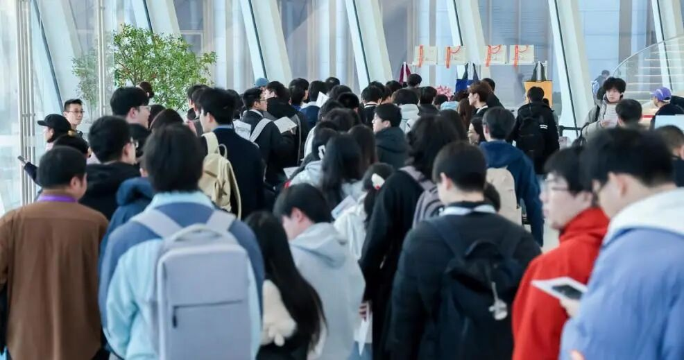


### 【亮相展区，让镜头集体追焦】

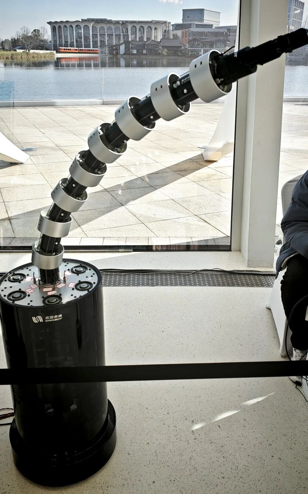
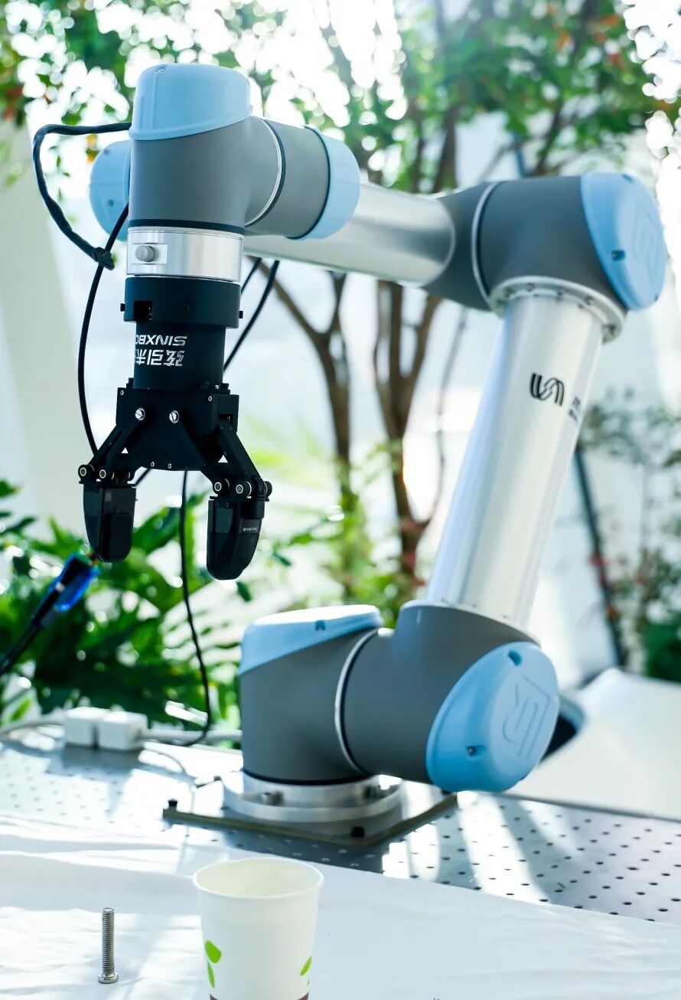


&emsp;&emsp;弦引未来作为华为云初创合作伙伴及HCDG技术圈代表企业应邀参加，并带来自研的新产品。同时与同台参展的千寻智能、无界方舟、拂曦科技等企业进行了深度行业交流及合作探索。


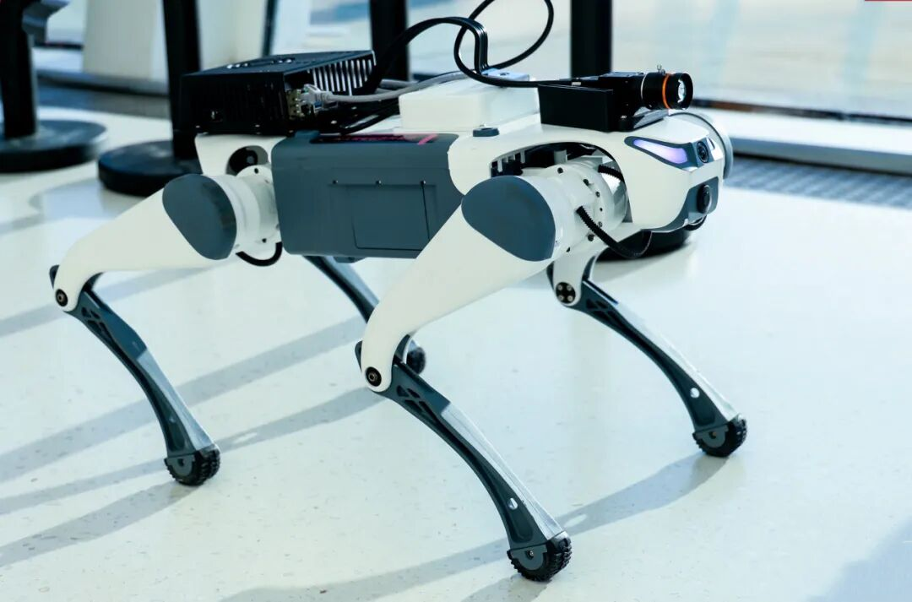
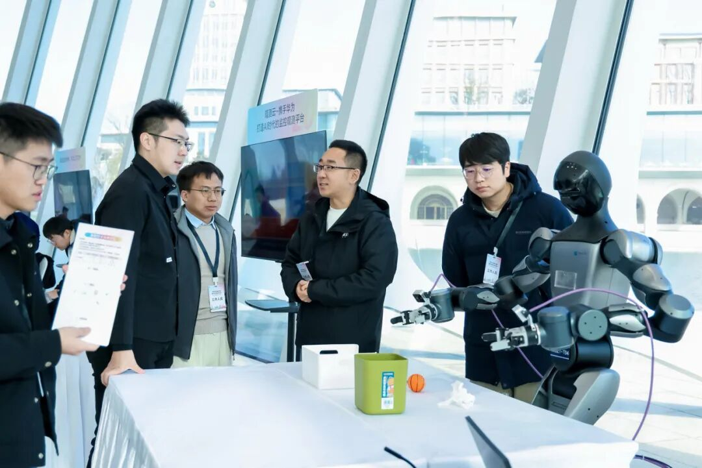



&emsp;&emsp;本次活动中，弦引未来团队携SinExplorer绳驱柔性勘探机器人、SynGrip多模态触觉夹爪等产品首次亮相开发者展区，出色的功能展示吸引现场目光，成为焦点。

&emsp;&emsp;多位华为高管亲临现场，细致观看演示后，与团队就技术细节、应用场景及未来趋势进行了深入探讨，双方共同展望了产业生态中的合作前景。

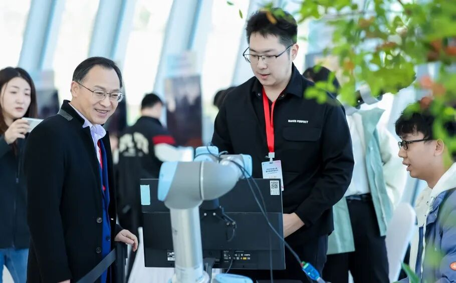

&emsp;&emsp;公司执行总裁马璁博士为华为战略研究院院长、2012实验室副总裁周红博士详细介绍了弦引未来与华为云的合作项目。
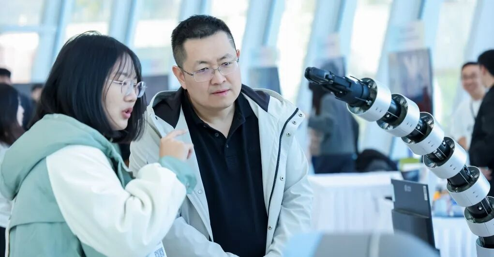
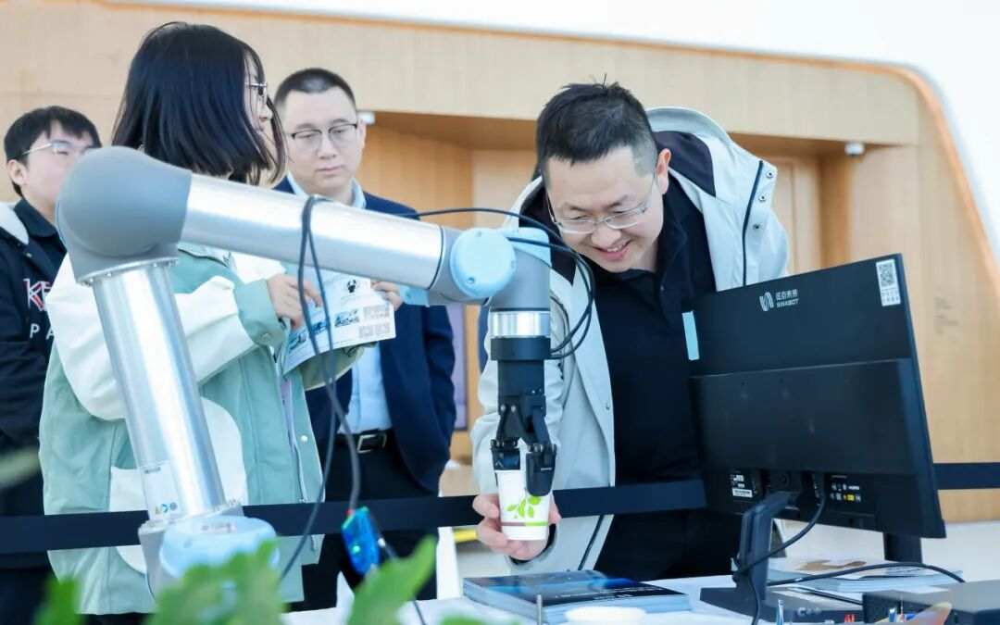

&emsp;&emsp;执行董事田蓥梅博士向华为高层团队详细介绍了项目技术与聚焦场景，并针对弦引未来与华为云的后续合作展开了探讨。华为云计算生态部总裁康晓宇参观后表示，产品表现的自适应抓取策略和精准力控令人印象深刻。
### 【行业对话，共建AI生态体系】
&emsp;&emsp;华为开发者年度会议是华为每年最重要的技术生态活动之一。本次会议旨在汇聚先锋开发力量，搭建开放共赢的生态平台。
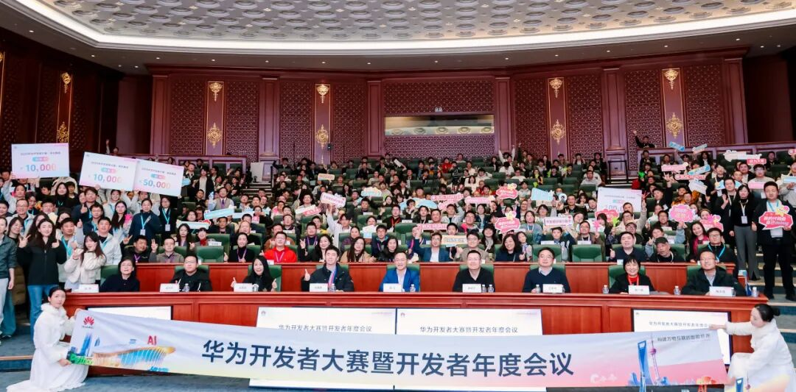

### CEO圆桌会议

&emsp;&emsp;在CEO圆桌环节，华为高级副总裁、华为云CEO周跃峰强调了开发者联合的意义，并指出华为云意在共同打造行业AI的“梦工厂”。
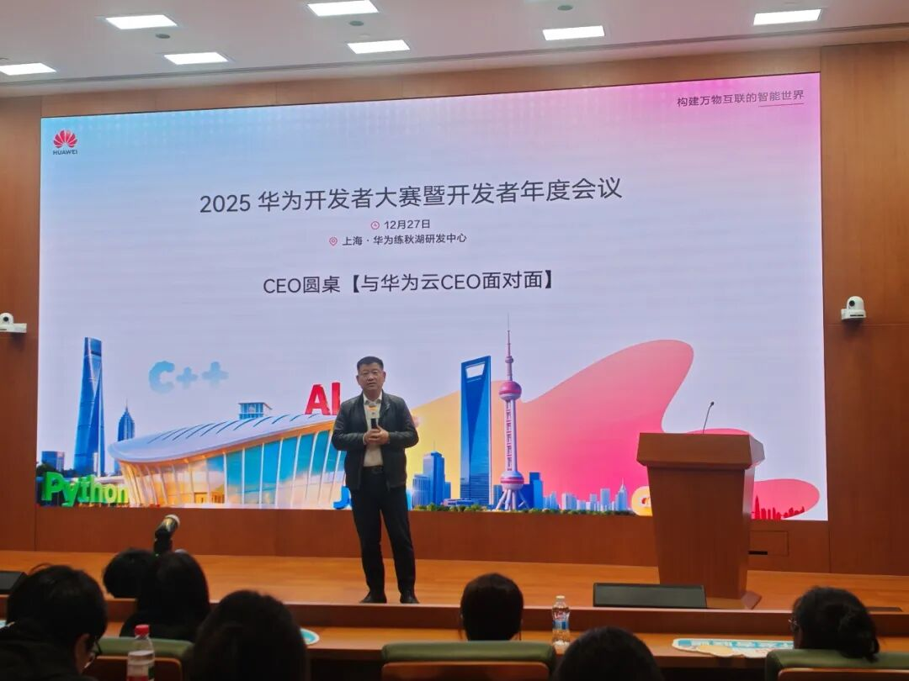
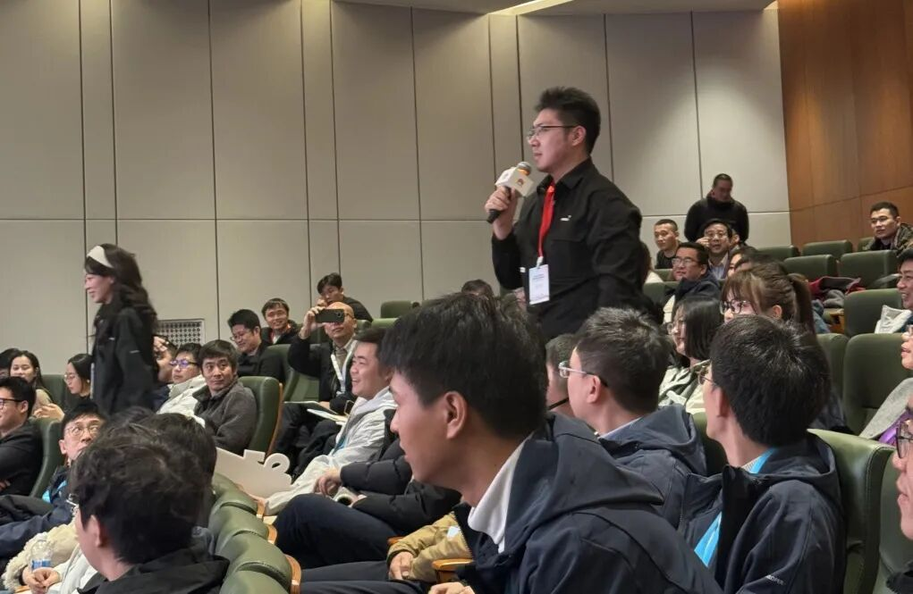

&emsp;&emsp;会议上，执行总裁马璁向华为云CEO周跃峰提问：“弦引未来作为华为的初创合作伙伴，华为云对于初创公司在具身智能生态上有什么样的规划？”

&emsp;&emsp;周跃峰针对提问表示：“目前具身智能行业还面临算法能力亟待优化、具身智能体部位与算法不够适配等难题，这些难题都要求强大的算力支持，华为云未来将通过开放平台算力资源、数据模型工具等措施，降低具身智能企业研发成本，来促进行业发展。”

### 华为开发者空间圆桌会议
&emsp;&emsp;执行总裁马璁博士还参加了由华为云开发者联盟王希海部长主持的华为开发者空间圆桌会议，会议基于华为昇腾、鲲鹏和鸿蒙生态的发展和规划展开讨论。
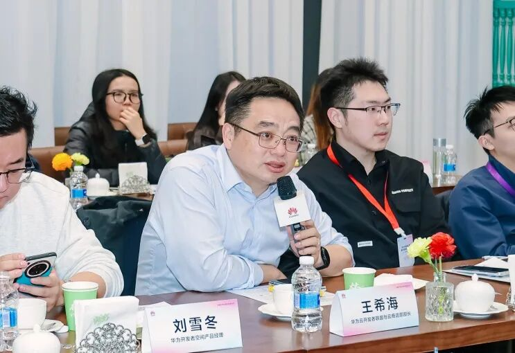

&emsp;&emsp;璁博士在会议中表达了具身智能的发展现状以及行业瓶颈，并希望推进与华为的进一步合作，获得了积极回应。
&emsp;&emsp;通过与众多顶尖专家、行业领袖及生态伙伴深入的探索与交流，安徽弦引未来作为“绳驱机器人+具身智能”领域的代表企业，将以更加开放的心态寻求AI生态的协同与合作，共同推动具身智能行业的标准化、产业化进程。

### 技术前瞻，触觉智能新蓝图

&emsp;&emsp;华为开发者大会不仅是技术展示的平台，更是生态协同的纽带。

&emsp;&emsp;具身智能作为人工智能发展的重要方向，正推动机器人技术从“感知智能”向“行动智能”跨越。在这一趋势下，绳驱柔性技术与多模态触觉感知的重要性日益凸显，它使机器人不仅能“看到”环境，更能“感受”物体属性，实现更加精细、安全的操作。

&emsp;&emsp;弦引未来凭借在绳驱柔性技术领域的技术积累，正站在这一浪潮的前沿。公司未来将携手更多合作伙伴，共同构建绳驱技术的新标准与新生态，让机器更懂世界，让智能触手可及。